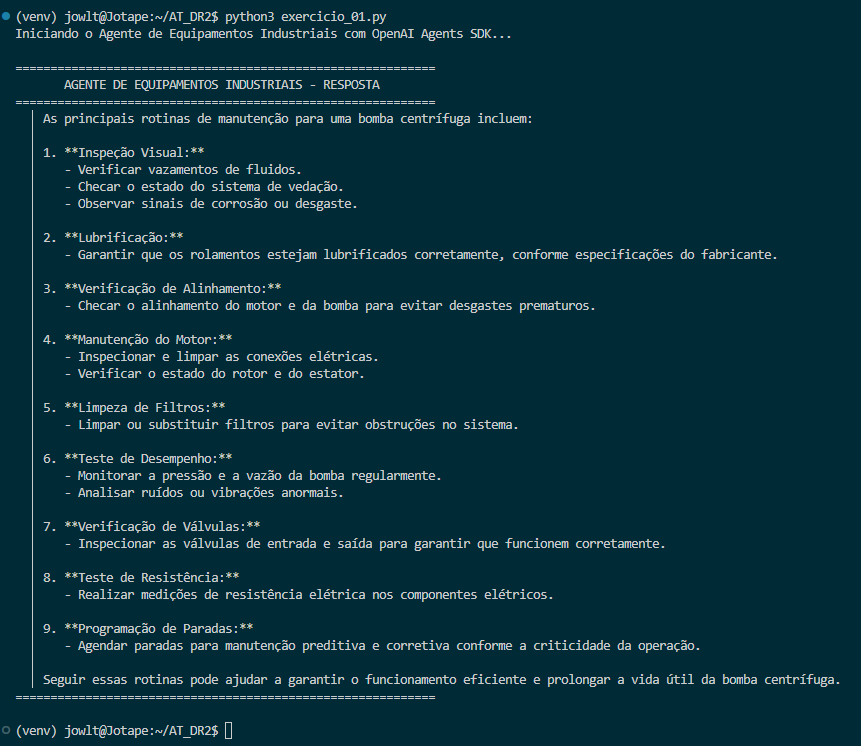

# Exercício 1 - Ambiente e Primeiro Agente do Projeto

## Parte Discursiva

### 1. Papel dos Componentes do Antigravity no Fluxo de Trabalho

No fluxo de trabalho de desenvolvimento com a IDE Antigravity, cada componente desempenha uma função estratégica e complementar:

- **Editor**: É o ambiente principal de desenvolvimento e manipulação direta de código. É onde o desenvolvedor escreve, edita e refatora os arquivos do projeto. No Editor, recursos de assistência em tempo real como o *Tab Completion* atua oferecendo autocompletar inteligente de linhas e blocos de código contextuais com baixíssima latência.
- **Agent Manager**: É o painel de controle e orquestração dos agentes autônomos de IA na IDE. Ele gerencia as sessões ativas dos agentes, acompanha o progresso de tarefas complexas, controla o escopo de permissões de execução e mantém o histórico de interações e contextos utilizados em tarefas que envolvem múltiplos arquivos.
- **Playground**: É o espaço de prototipação rápida e testes interativos. Permite testar *system prompts*, ajustar parâmetros como *temperature* e comparar respostas de diferentes modelos em tempo real sem a necessidade de alterar ou executar o código-fonte principal da aplicação.

---

### 2. Escolha de Ferramenta para Tarefas do Dia a Dia

Considerando a eficiência técnica, latência e consumo de contexto:

1. **Ajuste pontual de uma linha já existente**:
   - **Ferramenta indicada**: *Tab Completion* (Autocompletar / Sugestão Inline).
   - **Justificativa Técnica**: Para correções pontuais e edições de uma única linha, o *Tab Completion* é ideal por operar com resposta quase instantânea, mantendo o desenvolvedor no fluxo de escrita sem a necessidade de alternar janelas ou gerar um plano de execução. Invocar um agente completo para uma única linha causaria latência desnecessária e consumo excessivo de tokens de contexto.

2. **Planejamento e implementação de uma nova funcionalidade que altera múltiplos arquivos**:
   - **Ferramenta indicada**: *Agente da IDE do Antigravity*.
   - **Justificativa Técnica**: Tarefas de arquitetura e alterações distribuídas em múltiplos arquivos exigem visão global do repositório, capacidade de raciocínio encadeado (*reasoning*), leitura sintática do projeto e chamada de ferramentas (*tool use*). O Agente consegue planejar os passos, modificar arquivos simultaneamente e garantir a coerência entre módulos, algo que o *Tab Completion* não é capaz de realizar por ser escopado localmente.

---

## Estrutura do Código e Execução

O código-fonte do exercício foi implementado no arquivo `exercicio_01.py` utilizando o pacote `python-dotenv` para carregar a variável `OPENAI_API_KEY` a partir do arquivo `.env` (fora do código-fonte), conforme as boas práticas de segurança.

A solução assíncrona utiliza as primitivas `Agent` e `Runner` importadas do pacote oficial `openai-agents`, realizando a execução com `async/await` e `asyncio.run()`.

A função auxiliar `format_agent_response` foi construída para formatar o texto de saída antes da impressão no terminal.

---

## Evidência de Execução

A imagem abaixo demonstra a execução do programa `exercicio_01.py` no terminal integrado da IDE.

