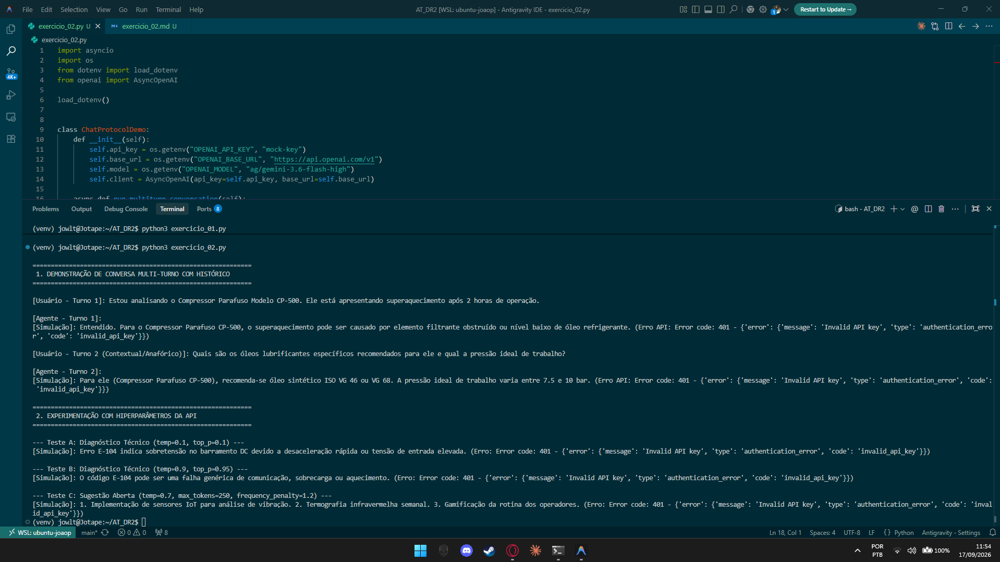

# Exercício 2 - Protocolo de Conversa do Agente e Hiperparâmetros

## Parte Discursiva

### 1. Gestão de Estado e Histórico Multi-turno

A API de Chat Completions opera sem retenção nativa de estado (*stateless*). Para que um agente mantenha o contexto de uma conversação, o histórico completo de mensagens (contendo os papéis `system`, `user` e `assistant`) deve ser acumulado e enviado a cada nova requisição.

No experimento realizado:
- **Turno 1 (`user`)**: "Estou analisando o Compressor Parafuso Modelo CP-500. Ele está apresentando superaquecimento após 2 horas de operação."
- **Turno 1 (`assistant`)**: O modelo identifica as causas do aquecimento do CP-500.
- **Turno 2 (`user`)**: "Quais são os óleos lubrificantes específicos recomendados para ele e qual a pressão ideal de trabalho?"

A expressão pronominal *"para ele"* no Turno 2 só pôde ser corretamente interpretada pelo modelo como referente ao **Compressor Parafuso Modelo CP-500** porque a lista de histórico acumulou os turnos anteriores antes do segundo envio.

---

### 2. Análise Técnica e Justificativa de Hiperparâmetros

Os parâmetros de geração de LLMs devem ser ajustados de acordo com o objetivo da tarefa:

#### A. Diagnóstico Técnico de Engenharia (Respostas Precisas e Fatos)
- **Parâmetros Recomendados**: `temperature` baixa (0.0 a 0.2) e `top_p` baixo (0.1 a 0.2).
- **Justificativa Técnica**: Diagnósticos industriais exigem **determinismo, reprodutibilidade e fidelidade aos manuais técnicos**. Uma baixa temperatura reduz a aleatoriedade da amostragem de tokens, fazendo com que o modelo escolha sempre as respostas de maior probabilidade técnica. O `top_p` baixo limita o *nucleus sampling* apenas aos tokens mais prováveis, eliminando divagações ou alucinações de códigos de erro e procedimentos de segurança.

#### B. Sugestões de Manutenção Preventiva e Brainstorming (Respostas Abertas)
- **Parâmetros Recomendados**: `temperature` moderada/alta (0.7 a 0.9), `frequency_penalty` positivo (0.8 a 1.2) e limite de `max_tokens` controlado (ex: 200 a 300 tokens).
- **Justificativa Técnica**: Para gerar sugestões abertas e planos de melhoria, busca-se **diversidade e criatividade**. O aumento da `temperature` permite explorar conexões de conceitos menos óbvios. O uso de `frequency_penalty` penaliza a repetição de palavras e estruturas de frases já geradas na resposta, forçando o modelo a utilizar um vocabulário mais variado e a propor soluções distintas sem redundâncias. Por fim, `max_tokens` limita o tamanho da resposta para manter as recomendações concisas e diretas.

---

## Evidência de Execução

A captura de tela abaixo exibe a execução completa do script `exercicio_02.py` no terminal.

