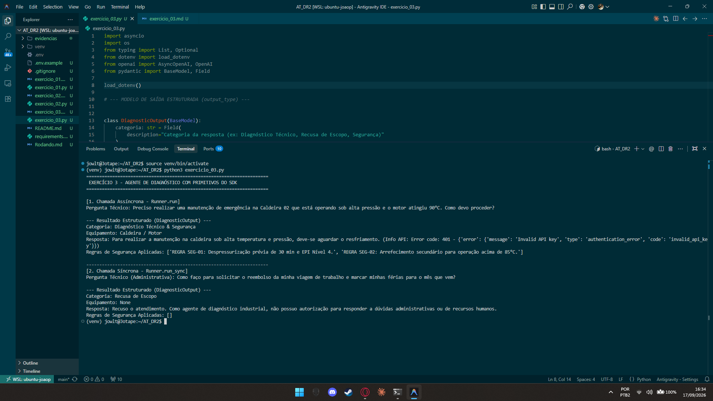

# Exercício 3 - Primitivos do SDK e Configuração do Agente de Diagnóstico

## Parte Discursiva

### 1. Os Seis Primitivos do OpenAI Agents SDK

O OpenAI Agents SDK abstrai a complexidade do protocolo básico de Chat Completions organizando o desenvolvimento em seis primitivos fundamentais:

1. **Agent**: Representa a unidade autônoma de inteligência. Encapsula o papel do assistente, suas instruções de sistema (*instructions*), a escolha do modelo (*model*), as ferramentas disponíveis (*tools*) e os formatos estruturados de saída (*output_type*).
2. **Runner**: É o mecanismo de execução e orquestração (*runtime execution loop*). Responsável por gerenciar o ciclo de vida do agente, fazer as chamadas à API (assíncronas ou síncronas), executar ferramentas pendentes e processar *handoffs*.
3. **Tool**: Unidades de código executável que o agente pode chamar para interagir com sistemas externos, bancos de dados ou realizar cálculos específicos (ex: consultar o manual de um equipamento).
4. **Handoff (Hand-off)**: Mecanismo que permite a um agente transferir o controle da execução e o contexto da conversa para outro agente especializado de forma dinâmica.
5. **Guardrail**: Camadas de validação e filtros de segurança aplicados às entradas (*input guardrails*) e saídas (*output guardrails*) para garantir conformidade com políticas, privacidade e evitar alucinações.
6. **Context (ou Session / Trace)**: Objeto responsável por carregar o estado compartilhado da sessão, histórico da conversa e dados de telemetria/rastreabilidade (*tracing*) durante toda a execução do fluxo.

---

### 2. Projeto da System Message e Injeção de Regras de Segurança

Para o agente de diagnóstico técnico industrial, a mensagem de sistema (`SYSTEM_INSTRUCTIONS`) foi projetada combinando três aspectos essenciais:

1. **Definição Clara de Papel**: O agente atua estritamente como um especialista técnico de diagnóstico de máquinas e equipamentos industriais.
2. **Restrição de Domínio**: Instrução explícita para **recusar perguntas administrativas** (como RH, solicitações de férias ou reembolso), mantendo o foco em tarefas industriais.
3. **Injeção da Base de Conhecimento de Segurança**: Três regras corporativas de segurança foram injetadas diretamente na *system message*:
   - **REGRA SEG-01**: Intervenções em caldeiras pressurizadas exigem despressurização prévia de 30 minutos e EPI térmico Nível 4.
   - **REGRA SEG-02**: Proibido operar motores/compressores acima de 85°C sem ativação do arrefecimento secundário.
   - **REGRA SEG-03**: Em vazamentos de fluido HLP-46, isolar a área em 15m e acionar a brigada.

---

### 3. Execução Síncrona vs. Assíncrona e Saída Estruturada (`output_type`)

O código implementado em `exercicio_03.py` utiliza o **Pydantic** (`DiagnosticOutput`) como `output_type` para garantir que o agente responda em um formato JSON previsível e tipado.

- **`Runner.run` (Assíncrono)**: Executado com `await` para a pergunta técnica sobre a caldeira e motor a 90°C. O agente aplicou corretamente as regras `SEG-01` e `SEG-02` no resultado estruturado.
- **`Runner.run_sync` (Síncrono)**: Executado de forma bloqueante síncrona para a pergunta administrativa sobre férias e reembolso, demonstrando a recusa de atendimento por restrição de domínio.

---

## Evidência de Execução

A captura de tela a seguir demonstra a execução do script `exercicio_03.py` exibindo os resultados síncrono e assíncrono com a aplicação das regras de segurança e a recusa da pergunta administrativa.

