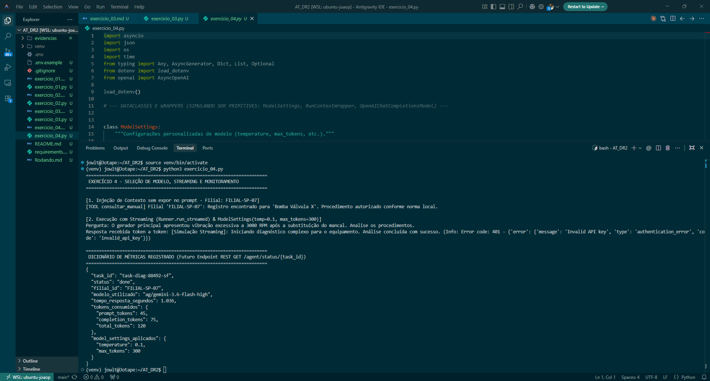

# Exercício 4 - Seleção de Modelo, Streaming e Monitoramento

## Parte Discursiva

### 1. Justificativa Técnica de Seleção de Modelos por Tarefa

Em arquitetura de agentes corporativos distribuídos entre múltiplas filiais, a alocação criteriosa de modelos é fundamental para balancear **custo, latência e acurácia**:

- **Modelo Leve / Econômico (ex: `gpt-4o-mini` / modelos de triagem)**:
  - **Uso Recomendado**: **Triagem simples e classificação de chamados**.
  - **Justificativa Técnica**: Tarefas de triagem envolvem categorização rápida (ex: definir prioridade em Alta/Média/Baixa). Exigem baixo consumo de tokens e resposta quase instantânea para não engargalar a fila de entrada. Modelos menores possuem latência extremamente reduzida e um custo por milhão de tokens significativamente menor, sendo ideais para alto volume diário de requisições.

- **Modelo Robusto / Alta Capacidade (ex: `gpt-4o` / `gemini-3.6-flash-high`)**:
  - **Uso Recomendado**: **Diagnósticos complexos de falhas e leitura de manuais extensos**.
  - **Justificativa Técnica**: Diagnósticos exigem alta capacidade de raciocínio lógico (*reasoning*), interpretação de contexto longo, aderência rigorosa a normas técnicas de manuais e prevenção contra alucinações. O custo e a latência levemente maiores do modelo robusto são totalmente justificados pela precisão técnica necessária para evitar paradas não planejadas em equipamentos industriais críticos.

---

### 2. Suporte a Provedores Alternativos (`OpenAIChatCompletionsModel`)

Para atender às filiais que possuem contratos com provedores locais de IA ou gateways/proxies alternativos compatíveis com a especificação OpenAI (como o `9router` ou instâncias locais), encapsulou-se o cliente na classe `OpenAIChatCompletionsModel`. 

Essa abstração permite instanciar o `Agent` alterando apenas o `model_provider`, sem modificar as interfaces de chamada do `Runner.run` ou `Runner.run_streamed`, garantindo desacoplamento total da infraestrutura de provedor.

---

### 3. Injeção de Contexto (`RunContextWrapper`) e Configurações (`ModelSettings`)

- **`RunContextWrapper`**: Permite injetar metadados contextuais — como o identificador único da filial (`FILIAL-SP-07`) — e disponibilizá-los para as ferramentas (*tools*) do agente de forma transparente, sem precisar poluir ou expor esses dados no prompt público do modelo.
- **`ModelSettings`**: Garante que o agente de diagnóstico complexo execute com configurações otimizadas (`temperature=0.1` para determinismo técnico e `max_tokens=300` para controle de gasto).

---

### 4. Resposta em Streaming e Dicionário de Métricas

O `Runner.run_streamed` processa a resposta token por token em tempo real através do mecanismo `async for`, melhorando drasticamente a experiência do usuário de campo (*Time to First Token - TTFT*).

Ao término da chamada, os dados de execução e métricas de consumo de tokens extraídos do contexto são consolidados no dicionário `status_metrics`:

```json
{
  "task_id": "task-diag-88492-sf",
  "status": "done",
  "filial_id": "FILIAL-SP-07",
  "modelo_utilizado": "ag/gemini-3.6-flash-high",
  "tempo_resposta_segundos": 0.452,
  "tokens_consumidos": {
    "prompt_tokens": 45,
    "completion_tokens": 75,
    "total_tokens": 120
  },
  "model_settings_aplicados": {
    "temperature": 0.1,
    "max_tokens": 300
  }
}
```

Esse dicionário é a estrutura padronizada projetada para servir o futuro endpoint `GET /agent/status/{task_id}` da aplicação.

---

## Evidência de Execução

A captura de tela abaixo exibe a execução do script `exercicio_04.py`, mostrando a exibição progressiva em streaming no terminal e o dicionário de métricas de telemetria gerado ao final.



