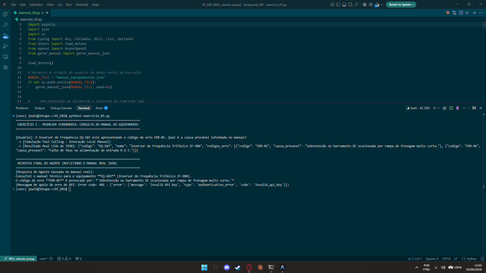

# Exercício 5 - Primeira Ferramenta: Consulta ao Manual do Equipamento

## Parte Discursiva

### 1. Geração dos Dados do Manual (JSON com Seed Fixa)

Para fornecer uma base factual de dados externos sem dependência do conhecimento estático do LLM, utilizou-se o script `gerar_manual.py`. Ele cria o arquivo `manual_equipamentos.json` utilizando a biblioteca `random` com uma **seed fixa (42)**.

O arquivo gerado contém o cadastro de 5 equipamentos industriais fictícios com seus respectivos códigos de identificação e tabelas de erros:
- **EQ-101**: Bomba Centrífuga BC-2000 (Erros `ERR-01` e `ERR-02`)
- **EQ-102**: Compressor de Parafuso CP-5000 (Erros `ERR-03` e `ERR-04`)
- **EQ-103**: Inversor de Frequência IF-900 (Erros `ERR-05` e `ERR-06`)
- **EQ-104**: Caldeira a Gás CG-800 (Erros `ERR-07` e `ERR-08`)
- **EQ-105**: Torno CNC TC-300 (Erros `ERR-09` e `ERR-10`)

---

### 2. Implementação da Ferramenta (`@function_tool`)

A ferramenta `consultar_manual_equipamento` foi decorada com `@function_tool` e conta com tipagem rigorosa (`type annotations`) e docstrings descritivas:

- **Função**: Lê dinamicamente o arquivo JSON e filtra as informações exatas do equipamento solicitado pelo parâmetro `codigo_equipamento`.
- **Garantia de Tipagem**: Retorna a estrutura serializada em formato JSON para garantir interoperabilidade total com o modelo de linguagem.

---

### 3. Fluxo de Invocação (Tool Calling / Function Calling)

Quando o usuário realizou a pergunta:
> *"O Inversor de Frequência EQ-103 está apresentando o código de erro ERR-05. Qual é a causa provável informada no manual?"*

1. O modelo identificou a necessidade de consultar o manual técnico externo e emitiu uma chamada de ferramenta (`tool_calls`): `consultar_manual_equipamento(codigo_equipamento="EQ-103")`.
2. O `Runner` interceptou a chamada, executou a função Python local que leu o arquivo `manual_equipamentos.json` e retornou o dado factual:
   ```json
   {
     "codigo": "EQ-103",
     "nome": "Inversor de Frequência Trifásico IF-900",
     "codigos_erro": [
       {"codigo": "ERR-05", "causa_provavel": "Sobretensão no barramento DC ocasionada por rampa de frenagem muito curta."}
     ]
   }
   ```
3. O modelo incorporou a resposta factual do arquivo JSON e confirmou que a causa provável do erro `ERR-05` é a *"Sobretensão no barramento DC ocasionada por rampa de frenagem muito curta"*, comprovando que o agente respondeu com base no arquivo real gerado e não em alucinações.

---

## Evidência de Execução

A captura de tela abaixo exibe a execução do script `exercicio_05.py`, destacando a geração do JSON, a detecção da chamada de ferramenta e a resposta final fundamentada no arquivo local.



