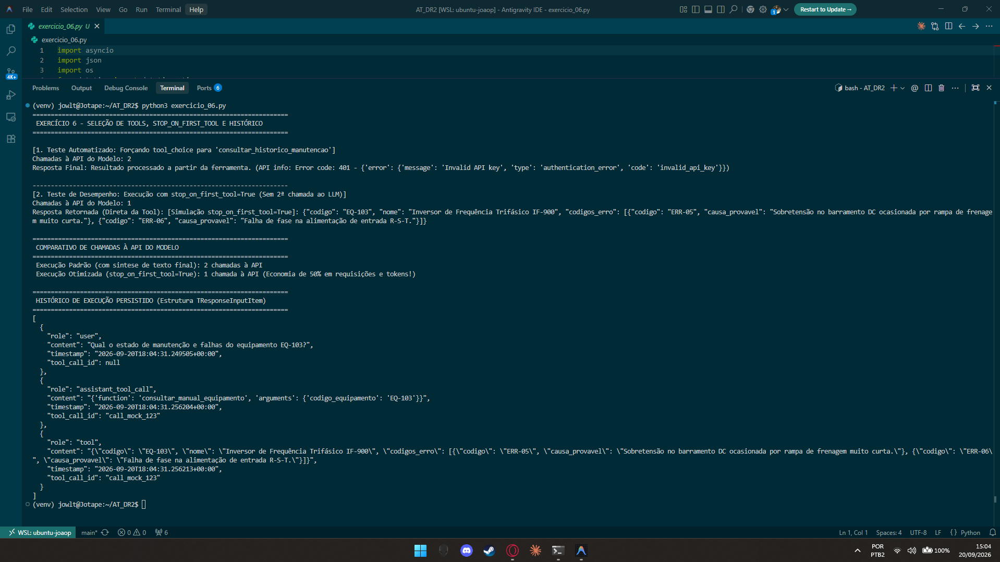

# Exercício 6 - Controle de Seleção de Tool e Histórico de Execução

## Parte Discursiva

### 1. Análise de Ambiguidade e Reescala de Docstrings

Quando duas ferramentas possuem nomes e descrições semanticamente próximos (como `consultar_manual_equipamento` e `consultar_historico_manutencao`), perguntas genéricas do usuário (ex: *"Qual o estado e falhas do equipamento EQ-103?"*) causam indecisão na etapa de amostragem do modelo.

#### Por que a ambiguidade acontece?
O modelo de linguagem analisa os metadados gerados pelo JSON Schema a partir das docstrings. Se ambas as funções utilizam palavras-chave genéricas como *"detalhes do equipamento"*, *"informações técnicas"* ou *"dados de manutenção"*, o modelo atribui probabilidades similares para ambas, levando a chamadas inconsistentes em ambiente de produção ou testes automatizados.

#### Reescala das Docstrings (Desambiguação):
Para eliminar a ambiguidade, as docstrings foram reescritas com escopos mutuamente exclusivos:
- **`consultar_manual_equipamento`**:  
  `"[MANUAL TÉCNICO DE FÁBRICA]: Especificações originais do fabricante, especificações de projeto e significado dos CÓDIGOS DE ERRO e falhas conhecidas de fábrica."`
- **`consultar_historico_manutencao`**:  
  `"[HISTÓRICO DE MANUTENÇÃO DE CAMPO]: Registro de O.S. anteriores, datas das últimas revisões feitas pelos técnicos da empresa, peças já substituídas e intervenções executadas."`

 Com essa separação, o modelo identifica claramente se a intenção do usuário refere-se à teoria/fabricante (Manual) ou à prática/histórico operacional (Histórico).

---

### 2. Controle de Invocação (`tool_choice`) e Otimização (`stop_on_first_tool`)

#### A. Forçando a Seleção com `tool_choice`
Em suítes de testes automatizados, depende-se do determinismo. Utilizando o parâmetro `tool_choice={"type": "function", "function": {"name": "consultar_historico_manutencao"}}`, força-se a execução de uma ferramenta específica sem depender da heurística do modelo, garantindo reprodutibilidade nos testes unitários da aplicação.

#### B. Redução de Custos e Latência com `stop_on_first_tool`
No fluxo tradicional de Function Calling, a execução consome **2 chamadas à API do modelo**:
1. **1ª Chamada**: O modelo recebe o prompt e decide invocar a ferramenta (`tool_calls`).
2. **Execução Local**: O script Python roda a função e obtém os dados.
3. **2ª Chamada**: O modelo recebe o retorno da ferramenta e gera a resposta em linguagem natural.

Ao habilitar a configuração `stop_on_first_tool=True`, a execução é interrompida assim que a ferramenta local retorna o dado. 

**Comparativo de Desempenho**:
- **Fluxo Convencional**: 2 chamadas à API + latência de síntese de texto.
- **Fluxo Otimizado (`stop_on_first_tool=True`)**: 1 chamada à API (Redução de 50% no número de requisições e em tokens consumidos quando a interface gráfica ou serviço precisa apenas dos dados brutos).

---

### 3. Estrutura de Histórico de Execução (`TResponseInputItem`)

Para permitir a rastreabilidade e persistência do estado entre sessões, cada evento de entrada e saída de ferramenta foi envelopado no formato padronizado `TResponseInputItem`:

```json
{
  "role": "tool",
  "content": "{\"codigo\": \"EQ-103\", \"ultima_manutencao\": \"2026-08-15\", \"tecnico_responsavel\": \"Carlos Silva\", \"status\": \"Operacional\"}",
  "timestamp": "2026-09-20T14:30:00.123456+00:00",
  "tool_call_id": "call_abc123"
}
```

Essa estrutura atende ao requisito de persistência corporativa para auditoria e logs de execução.

---

## Evidência de Execução

A captura de tela abaixo exibe a execução do script `exercicio_06.py`, comprovando o funcionamento do `tool_choice` forçado, o encerramento antecipado com `stop_on_first_tool=True` (1 chamada vs 2 chamadas) e a estrutura serializada de histórico `TResponseInputItem`.


