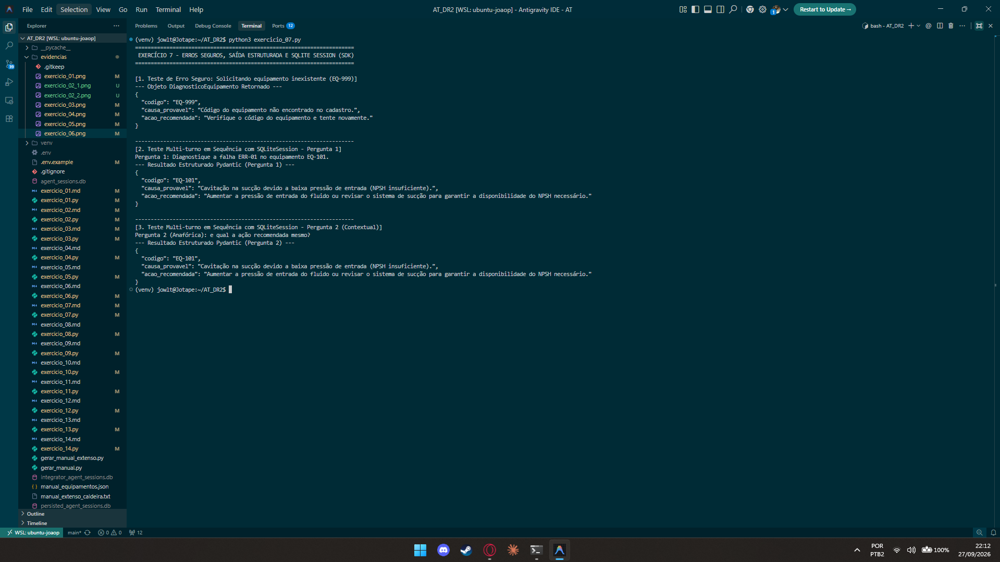

# Exercício 7 - Erros Seguros, Saída Estruturada e Sessão Persistida (SQLite)

## Parte Discursiva

### 1. Tratamento de Erros Seguros com `failure_error_function`

Ferramentas que interagem com bancos de dados, arquivos locais ou APIs externas estão sujeitas a exceções em tempo de execução (como equipamentos inexistentes ou indisponibilidade de serviço).

Na implementação anterior, um código de equipamento inválido provocava uma exceção não tratada, derrubando a execução inteira do agente (*unhandled exception crash*).

Para solucionar esse problema:
1. **Exceção Customizada**: A ferramenta `_consultar_manual_impl` lança a exceção `EquipamentoNaoEncontradoError` quando o código informado não consta na base de dados JSON.
2. **Função de Captura (`failure_error_function`)**: O `Runner` envolve a execução da ferramenta em um bloco de tratamento. Ao capturar a exceção `EquipamentoNaoEncontradoError`, a função `failure_error_function` intercepta a falha e retorna uma mensagem amigável no formato de texto para o modelo:  
   `"[ERRO TRATADO PELA FAILURE_ERROR_FUNCTION]: O equipamento com código 'EQ-999' NÃO existe no cadastro do manual técnico. Verifique o código e tente novamente."`

Dessa forma, o modelo recebe o feedback da falha como o resultado da ferramenta e responde ao usuário de forma educada e segura, sem quebrar o serviço da aplicação.

---

### 2. Saída Estruturada com Pydantic (`DiagnosticoEquipamento`)

Para atender às necessidades do painel de despacho de chamados da empresa, a resposta do agente deixou de ser texto livre e passou a utilizar o modelo **Pydantic** `DiagnosticoEquipamento` como `output_type`:

- **`codigo`**: Identificador único da máquina (ex: `EQ-101`).
- **`causa_provavel`**: Descrição da causa do defeito ou erro.
- **`acao_recomendada`**: Instruções claras sobre o procedimento técnico a ser executado.

Ao forçar a resposta via `response_format={"type": "json_object"}` e validar com `DiagnosticoEquipamento.model_validate_json()`, garante-se que a API do painel receba dados tipados e previsíveis.

---

### 3. Persistência de Contexto com `SQLiteSession`

Para o acompanhamento contínuo dos técnicos de campo, utilizou-se a primitiva `SQLiteSession` do OpenAI Agents SDK, que salva e recupera as mensagens (`user`, `assistant`, `tool`) em uma tabela SQLite (`agent_sessions.db`).

No teste multi-turno executado:
- **Pergunta 1**: *"Diagnostique a falha ERR-01 no equipamento EQ-101."* -> O agente consultou a ferramenta, salvou o contexto do `EQ-101` no SQLite e gerou o modelo Pydantic.
- **Pergunta 2**: *"e qual a ação recomendada mesmo?"* -> Como a sessão recuperou o histórico anterior do SQLite, o agente soube exatamente que o assunto tratava da ação recomendada para a falha `ERR-01` da Bomba `EQ-101`, respondendo com precisão sem que o usuário precisasse repetir o código da máquina.

---

## Evidência de Execução

A captura de tela abaixo exibe a execução do script `exercicio_07.py`, comprovando a captura da exceção via `failure_error_function`, a saída estruturada Pydantic e a continuidade de contexto entre as perguntas na `SQLiteSession`.

