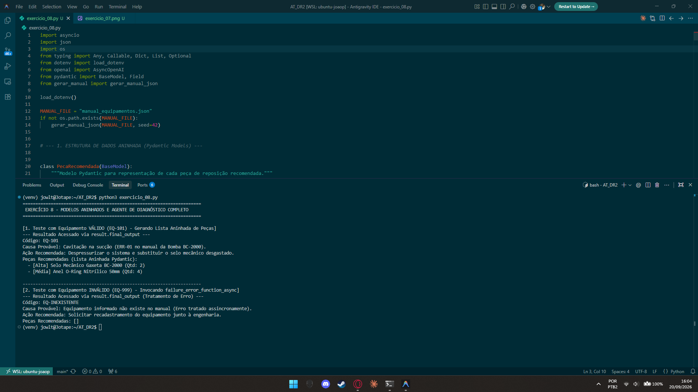

# Exercício 8 - Modelos Aninhados e Agente de Diagnóstico Completo

## Parte Discursiva

### 1. Justificativa Técnica da Estrutura de Dados (Lista Aninhada vs. Campos Separados)

Na modelagem do schema Pydantic `DiagnosticoEquipamento`, a representação das peças de reposição foi feita através de uma **lista aninhada de objetos tipados** (`pecas_recomendadas: List[PecaRecomendada]`), em vez de utilizar campos planos/separados (como `peca_1_nome`, `peca_1_qtd`, `peca_2_nome`, etc.).

#### Justificativa Técnica:
1. **Flexibilidade e Cardinalidade Variável**: Uma intervenção de manutenção pode não exigir nenhuma peça de reposição (lista vazia `[]`) ou exigir múltiplas peças (1, 3 ou N itens). Estruturar em lista aninhada permite variação dinâmica da quantidade de itens sem a necessidade de definir um número arbitrário e engessado de campos opcionais no schema.
2. **Coesão Sintática e Tipo Forte**: O modelo `PecaRecomendada` agrupa atomicamente os atributos que pertencem à mesma entidade (`nome`, `quantidade`, `prioridade`). Caso fossem usados campos separados, a associação entre o nome da peça e sua respectiva quantidade ou prioridade ficaria implícita apenas pelo nome do atributo, aumentando a probabilidade de inconsistência de dados.
3. **Escalabilidade da API e Validação Pydantic**: A validação por esquemas aninhados garante que cada item da lista respeite individualmente as restrições de tipo (ex: `quantidade` como número inteiro positivo `>= 1`).

#### Implicações para a Aplicação Cliente (Painel de Despacho):
- **Facilidade de Renderização na UI**: No frontend do painel de despacho (React, Vue ou Flutter), uma lista aninhada em JSON é consumida diretamente por iteradores simples (`pecas_recomendadas.map(...)`), simplificando a criação de tabelas ou cards de ordens de serviço.
- **Integração com Sistemas de Estoque (ERP/WMS)**: O payload estruturado em array de objetos facilita a serialização direta para chamadas de API REST/gRPC com o sistema de almoxarifado ou ERP da empresa, permitindo realizar a reserva automatizada das peças recomendadas.

---

### 2. Ferramenta Assíncrona e `failure_error_function_async`

Para suportar alta concorrência em produção onde múltiplos técnicos realizam diagnósticos simultâneos, a ferramenta de consulta foi transformada em uma corrotina assíncrona (`async def _consultar_manual_async_impl`).

Acompanhando essa evolução, foi criado o tratador de erros assíncrono `failure_error_function_async`. Quando a ferramenta falha ao buscar um código inexistente (ex: `EQ-999`), a exceção `EquipamentoNaoEncontradoError` é capturada sem bloquear a *event loop* do Python, retornando a mensagem de erro formatada para o modelo sem derrubar a aplicação.

---

### 3. Acesso à Saída Estruturada via `result.final_output`

A execução do `Runner.run` encapsula o resultado no objeto `AgentResult`, disponibilizando a propriedade `result.final_output`. Isso permite ao código chamador acessar diretamente a instância tipada de `DiagnosticoEquipamento`, incluindo a lista aninhada de instâncias `PecaRecomendada`, com autocomplete nativo na IDE.

---

## Evidência de Execução

A captura de tela a seguir exibe a execução do script `exercicio_08.py`, demonstrando o processamento do equipamento válido (`EQ-101`) com a lista aninhada de peças e o teste com o código inválido (`EQ-999`) acionando o handler assíncrono.

