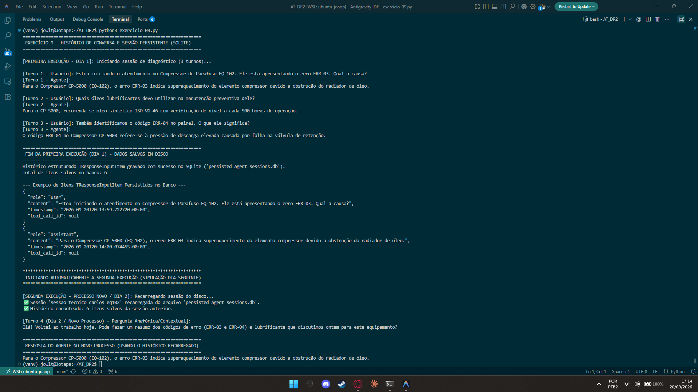

# Exercício 9 - Histórico de Conversa e Sessão Persistente (SQLite)

## Parte Discursiva

### 1. Gerenciamento Estruturado de Histórico (`TResponseInputItem`)

Para evitar a perda de contexto quando um técnico interrompe a sessão de diagnóstico e retorna posteriormente, o histórico de interação deve ser estruturado e tipado. 

Cada mensagem trocada entre o técnico e o agente é empacotada no modelo `TResponseInputItem`, que contém:
- **`role`**: Identificador do papel (`user`, `assistant` ou `tool`).
- **`content`**: O conteúdo textual da mensagem ou payload JSON serializado.
- **`timestamp`**: Carimbo de data/hora no padrão ISO 8601 UTC no momento exato do registro.
- **`tool_call_id`**: Identificador opcional para correlacionar chamadas de ferramentas.

---

### 2. Persistência em Disco com `SQLiteSession`

Diferente de manter o histórico em variáveis de memória volatil (que são perdidas assim que o programa Python encerra), a classe `SQLiteSession` grava os itens `TResponseInputItem` diretamente em uma tabela do banco de dados relacional SQLite (`persisted_agent_sessions.db`).

Esse mecanismo garante que:
1. O histórico sobreviva ao reinício da aplicação ou do servidor.
2. Múltiplos processos leiam e gravem o contexto de forma isolada por `session_id`.

---

### 3. Validação em Duas Execuções (Simulação de Dia Seguinte)

O experimento foi conduzido simulando a rotina real de um técnico de manutenção em duas etapas:

#### A. Primeira Execução (Dia 1 - Três Turnos de Interação)
No primeiro processo, o técnico iniciou o atendimento no **Compressor CP-5000 (EQ-102)** e realizou três perguntas em sequência:
1. *"Estou iniciando o atendimento no Compressor EQ-102 com o erro ERR-03. Qual a causa?"*
2. *"Quais óleos lubrificantes devo utilizar na manutenção preventiva dele?"*
3. *"Também identificamos o código ERR-04 no painel. O que ele significa?"*

Ao final da execução, as 6 mensagens (3 de usuário + 3 de assistente) foram gravadas com sucesso no arquivo `persisted_agent_sessions.db`.

#### B. Segunda Execução (Dia 2 - Reabertura no Novo Processo)
Em um novo processo (simulando o reinício do programa no dia seguinte), a `SQLiteSession` reabriu a sessão `sessao_tecnico_carlos_eq102` a partir do disco, recuperando todas as 6 mensagens gravadas.

O técnico enviou uma pergunta de acompanhamento:
> *"Olá! Voltei ao trabalho hoje. Pode fazer um resumo dos códigos de erro (ERR-03 e ERR-04) e lubrificante que discutimos ontem para este equipamento?"*

 O agente utilizou o histórico recuperado do SQLite e forneceu um resumo perfeito contemplando o equipamento **EQ-102**, as causas dos erros **ERR-03** (superaquecimento) e **ERR-04** (pressão de descarga elevada) e a recomendação do óleo **ISO VG 46**, sem que o técnico precisasse repetir o contexto.

---

## Evidência de Execução

A captura de tela abaixo exibe a execução do script `exercicio_09.py`, destacando os 3 turnos iniciais gravados no SQLite e o 4º turno respondido em um processo novo a partir dos dados em disco.

