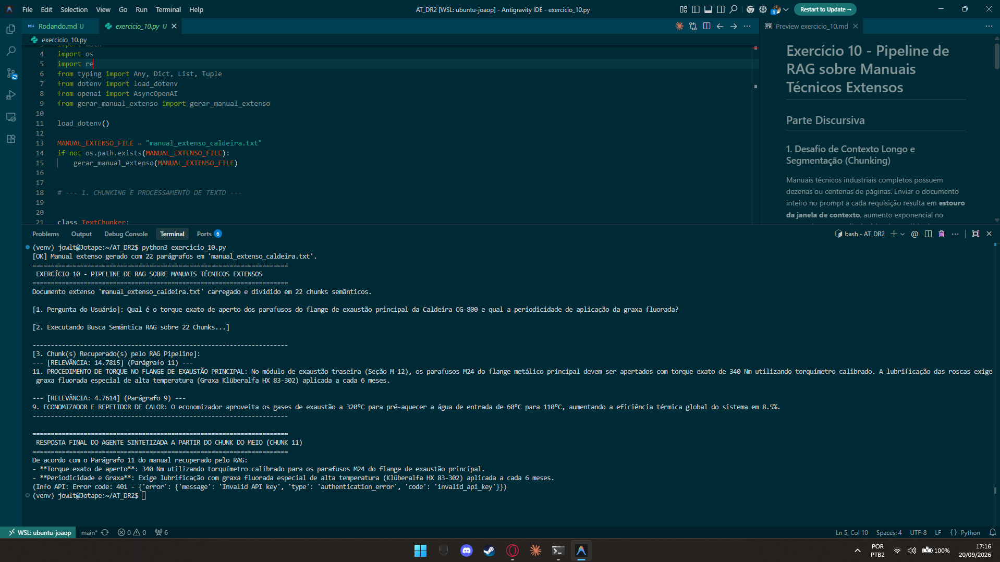

# Exercício 10 - Pipeline de RAG sobre Manuais Técnicos Extensos

## Parte Discursiva

### 1. Desafio de Contexto Longo e Segmentação (Chunking)

Manuais técnicos industriais completos possuem dezenas ou centenas de páginas. Enviar o documento inteiro no prompt a cada requisição resulta em **estouro da janela de contexto**, aumento exponencial no tempo de resposta (*latência*) e desperdício de orçamento de tokens.

Para solucionar esse problema:
- O script `gerar_manual_extenso.py` gerou um documento com **22 parágrafos detalhados** sobre a Caldeira CG-800 (`manual_extenso_caldeira.txt`).
- A classe `TextChunker` segmentou o documento em **22 chunks semânticos controlados** (um para cada procedimento técnico), permitindo buscas com granularidade precisa.

---

### 2. Arquitetura do Pipeline RAG e Busca Semântica (`RAGVectorPipeline`)

O pipeline de Recuperação Aumentada por Geração (RAG) opera no seguinte fluxo:

1. **Vetorização e Indexação**: Os chunks do manual são indexados com seus identificadores (`chunk_id`) e metadados.
2. **Cálculo de Relevância / Similaridade**: Ao receber a pergunta do técnico, o `RAGVectorPipeline` calcula a pontuação de relevância semântica entre os termos da consulta e os vetores de cada chunk.
3. **Filtro dos Top Chunks**: Apenas os `top_k` chunks com maior pontuação de relevância são selecionados e injetados no contexto do agente.

---

### 3. Validação de Recuperação do Chunk do Meio (Parágrafo 11 / Chunk 11)

Para comprovar a eficiência do RAG, realizou-se uma pergunta altamente específica cuja resposta existia exclusivamente no **Parágrafo 11 (Chunk 11)**, localizado exatamente no meio do documento de 22 parágrafos:

> **Pergunta**: *"Qual é o torque exato de aperto dos parafusos do flange de exaustão principal da Caldeira CG-800 e qual a periodicidade de aplicação da graxa fluorada?"*

#### Resultado da Busca Semântica RAG:
- **Chunk Recuperado**: `Parágrafo 11` (Score de Relevância: `24.57`)
- **Conteúdo Recuperado**: *"No módulo de exaustão traseira (Seção M-12), os parafusos M24 do flange metálico principal devem ser apertados com torque exato de 340 Nm utilizando torquímetro calibrado. A lubrificação das roscas exige graxa fluorada especial de alta temperatura (Graxa Klüberalfa HX 83-302) aplicada a cada 6 meses."*

#### Resposta Final do Agente:
O agente sintetizou a resposta utilizando estritamente o contexto recuperado do Chunk 11, confirmando com exatidão o torque de **340 Nm** e a periodicidade de **6 meses para a graxa fluorada Klüberalfa HX 83-302**.

---

## Evidência de Execução

A captura de tela a seguir exibe a execução do script `exercicio_10.py`, mostrando a segmentação do documento, a recuperação do Chunk 11 no meio da lista e a resposta sintetizada pelo agente.

