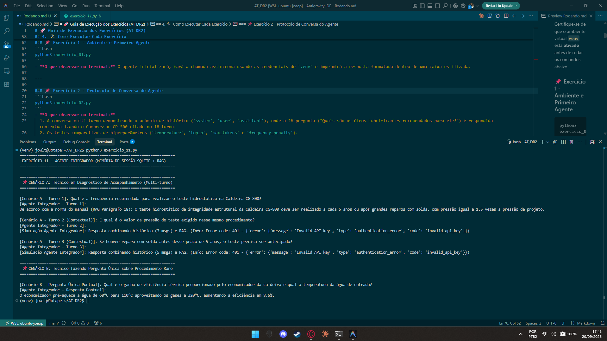

# Exercício 11 - Agente Integrador com Memória e Avaliação de Estratégia

## Parte Discursiva

### 1. Arquitetura do Agente Integrador (Híbrido)

O agente integrador desenvolvido em `exercicio_11.py` unifica duas camadas complementares de inteligência:
1. **Memória de Conversação Persistida (`SQLiteSession`)**: Retém o histórico completo de diálogos e interações passadas gravados no banco de dados SQLite, permitindo interpretar pronomes anafóricos e referências contextuais.
2. **Recuperação Semântica Aumentada (`RAGVectorPipeline`)**: Fatiou o manual técnico de 22 parágrafos em chunks e executa buscas semânticas para recuperar especificações de engenharia de alta precisão (ex: torques, pressões, porcentagens e periodicidades).

---

### 2. Avaliação dos Cenários Concretos de Uso

Para orientar a decisão da equipe de arquitetura quanto ao lançamento em produção, o comportamento do agente foi avaliado sob dois cenários práticos de campo:

#### 📌 CENÁRIO A: Atendimento de Acompanhamento Multi-turno (3 Perguntas Seguidas)
- **Turno 1**: *"Qual é a frequência recomendada para realizar o teste hidrostático na Caldeira CG-800?"*
- **Turno 2**: *"E qual é o valor da pressão de teste exigido **nesse mesmo procedimento**?"*
- **Turno 3**: *"Se houver reparo com solda **antes desse prazo**, o teste precisa ser antecipado?"*

#### 📌 CENÁRIO B: Pergunta Única e Pontual sobre Procedimento Raro
- **Turno Único**: *"Qual é o ganho de eficiência térmica proporcionado pelo economizador da caldeira e qual a temperatura da água de entrada?"*

---

### 3. Matriz de Avaliação de Estratégias de Memória

| Estratégia | Suficiente no Cenário A (Acompanhamento Multi-turno)? | Suficiente no Cenário B (Pergunta Única Pontual)? | Análise de Desempenho e Custo |
| :--- | :--- | :--- | :--- |
| **Apenas Memória de Conversa (`SQLiteSession`)** | ❌ **Inadequado**: O agente lembra do contexto da conversa, mas alucina ou falha ao citar números exatos de procedimentos complexos não presentes no histórico. | ❌ **Ineficiente**: Não possui acesso à base documental do manual extenso. | **Baixa Latência**, mas alta taxa de alucinação para especificações de engenharia. |
| **Apenas Busca Semântica (`RAG`)** | ❌ **Inadequado**: Falha nas perguntas anafóricas dos Turnos 2 e 3 (*"nesse mesmo procedimento"*, *"antes desse prazo"*), pois a query isolada não contém as palavras-chave necessárias para ranquear o chunk correto. | ✅ **Suficiente**: Localizou instantaneamente o Chunk 9 e retornou os **8.5% de eficiência** e **60°C para 110°C**. | **Excelente para buscas pontuais**, mas cego a diálogos contínuos. |
| **Estratégia Híbrida (SQLiteSession + RAG)** | ✅ **Necessário e Ideal**: O histórico resolve as referências anafóricas enquanto o RAG recupera os trechos documentais exatos. | ✅ **Ideal**: Atende com precisão total a busca pontual. | **Combinação Perfeita**: Garante retenção de contexto humano e precisão factual documental. |

---

### 4. Conclusão Técnica e Recomendação para Produção

- **No Cenário B (Consulta Pontual)**: Apenas o **RAG** é suficiente. Manter um histórico de conversa para consultas rápidas e isoladas traria apenas custo desnecessário de armazenamento e latência de contexto.
- **No Cenário A (Diálogo de Acompanhamento)**: A **Combinação Híbrida (SQLiteSession + RAG) é estritamente necessária**. Sem o histórico, o RAG falharia em entender a quem se refere o termo *"nesse mesmo procedimento"*. Sem o RAG, o histórico não saberia a pressão exata exigida pela norma técnica.

> **Recomendação para a Defesa em Vídeo**: Adotar a **Estratégia Híbrida** como padrão para o agente integrador de produção, garantindo que o técnico de campo tenha tanto a continuidade da conversa quanto a exatidão dos manuais de engenharia.

---

## Evidência de Execução

A captura de tela abaixo exibe a execução do script `exercicio_11.py`, demonstrando a resposta contextual multi-turno no Cenário A e a consulta pontual no Cenário B.

