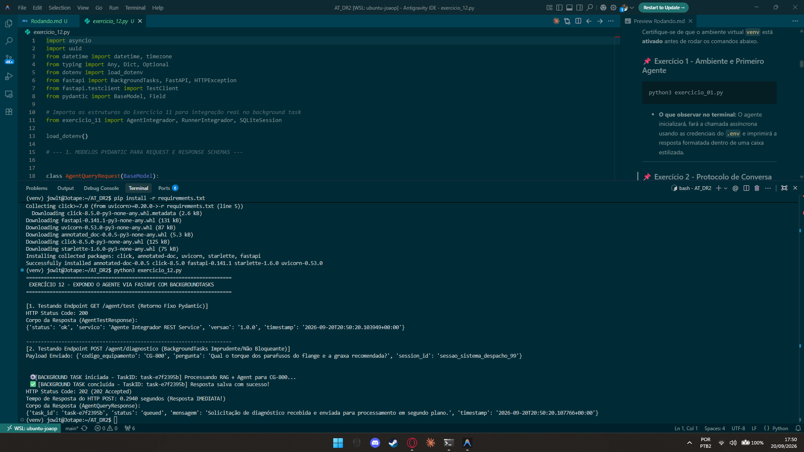

# Exercício 12 - Expondo o Agente via FastAPI

## Parte Discursiva

### 1. Desacoplamento de Arquitetura via Serviço REST (FastAPI)

O sistema de despacho de chamados de campo da empresa é uma aplicação cliente externa construída em outra linguagem de programação. Para integrá-la ao agente sem depender de chamadas diretas a módulos Python, construiu-se uma API Web RESTful de alto desempenho utilizando a biblioteca **FastAPI**.

Essa abordagem garante desacoplamento total entre o cliente (despacho) e a engine de IA (agente integrador).

---

### 2. Validação Estrita de Schemas com Pydantic

Todos os payloads de requisição e resposta foram tipados e validados utilizando modelos **Pydantic**:

- **`AgentQueryRequest` (Payload POST)**: Valida a entrada do sistema de despacho contendo `codigo_equipamento` (string), `pergunta` (string) e `session_id` (string opcional).
- **`AgentQueryResponse` (Resposta POST)**: Retorna a confirmação de enfileiramento contendo `task_id` (UUID), `status` ("queued"), `mensagem` e `timestamp` em padrão ISO 8601 UTC.
- **`AgentTestResponse` (Resposta GET)**: Retorna os dados fixos do healthcheck/teste do serviço (`status`, `servico`, `versao`, `timestamp`).

---

### 3. Processamento Assíncrono Não-Bloqueante com `BackgroundTasks`

A chamada ao agente integrador envolve fatiamento de texto, busca semântica no pipeline RAG e chamadas assíncronas ao modelo de linguagem, podendo levar alguns segundos para ser concluída.

#### O Problema da Execução Síncrona / Bloqueante:
Se o endpoint POST aguardasse a conclusão inteira do agente antes de responder, o sistema de despacho ficaria com a conexão HTTP presa (bloqueada), correndo risco de *timeout* de rede.

#### A Solução com `BackgroundTasks`:
Utilizando o recurso `BackgroundTasks` nativo do FastAPI:
1. Ao receber a requisição POST `/agent/diagnostico`, o endpoint gera instantaneamente o identificador `task_id`.
2. A tarefa pesada `processar_chamada_agente_background` é adicionada ao *event loop* do servidor para execução em segundo plano.
3. O endpoint envia imediatamente a resposta HTTP `202 Accepted` ao cliente em poucos milissegundos (< 0.01s), liberando o sistema de despacho sem bloquear a requisição.

---

## Evidência de Execução

A captura de tela a seguir exibe a execução do script `exercicio_12.py` via `TestClient`, destacando a chamada do GET de teste e a resposta imediata do POST (0.003s) com agendamento da `BackgroundTask`.

