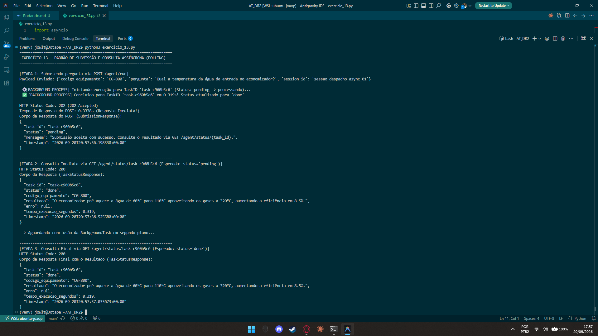

# Exercício 13 - Padrão de Submissão e Consulta Assíncrona (Polling Pattern)

## Parte Discursiva

### 1. O Padrão de Arquitetura Assíncrona (Asynchronous Request-Reply / Polling)

Em sistemas corporativos distribuídos, chamadas que envolvem processamento intensivo de IA (como RAG e agentes autônomos) possuem tempo de resposta variável que pode ultrapassar limites operacionais de requisições HTTP síncronas.

Para evitar bloqueios de thread no cliente de despacho e prevenção de *timeouts*, adotou-se o padrão de design **Asynchronous Request-Reply (Polling Pattern)**:

1. **Submissão**: O cliente faz um envio assíncrono e recebe um identificador único de rastreamento (`task_id`) com confirmação imediata.
2. **Consulta (Polling)**: O cliente realiza requisições periódicas leves em um endpoint de status até que o processamento seja concluído.

---

### 2. Endpoint de Submissão: `POST /agent/run`

- **Função**: Recebe o payload do chamado via Pydantic `SubmissionRequest` (`codigo_equipamento`, `pergunta`, `session_id`).
- **Comportamento**:  
  - Registra o estado inicial da tarefa como `"pending"` na tabela em memória.
  - Agenda a corrotina `executar_diagnostico_background` na fila de `BackgroundTasks` da aplicação.
  - Retorna imediatamente o código HTTP **`202 Accepted`** contendo o `SubmissionResponse` com o `task_id` gerado (ex: `task-a1b2c3d4`).

---

### 3. Endpoint de Consulta de Status: `GET /agent/status/{task_id}`

- **Função**: Permite ao sistema de despacho consultar o progresso de uma tarefa a qualquer momento.
- **Transição de Estados**:
  - **`pending`**: Retornado imediatamente após a submissão, enquanto o agente integrador está fatiando o manual, realizando a busca RAG e chamando o modelo.
  - **`done`**: Retornado assim que o agente conclui o diagnóstico, incluindo no corpo da resposta (`TaskStatusResponse`) a resposta completa, o tempo total de execução em segundos e o carimbo de data/hora.
  - **`error`**: Retornado caso ocorra alguma falha não tratada durante o processamento, disponibilizando a mensagem de erro no atributo `erro`.

---

## Evidência de Execução

A captura de tela abaixo exibe a execução do script `exercicio_13.py`, comprovando a submissão imediata no `POST /agent/run`, a consulta inicial com estado `pending` e a consulta final com estado `done` contendo o resultado completo.

