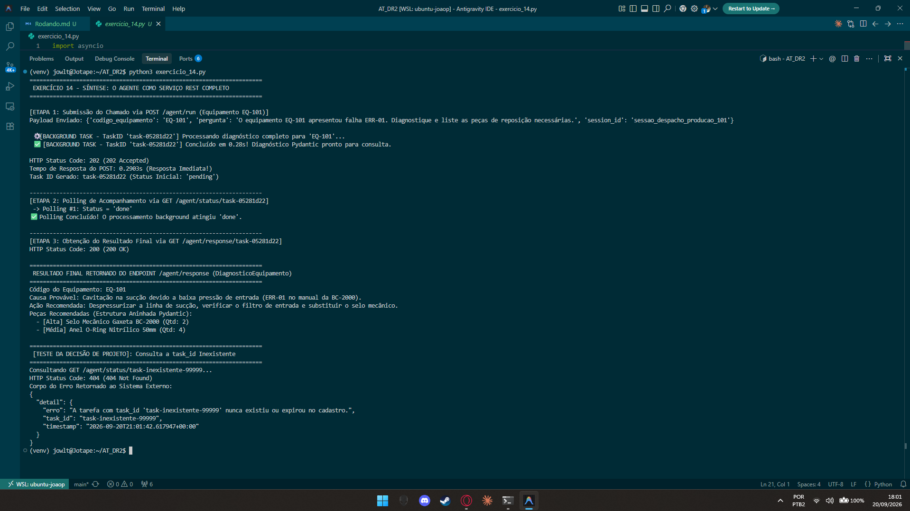

# Exercício 14 - Síntese: O Agente como Serviço REST Completo

## Parte Discursiva

### 1. Visão Geral da Arquitetura REST End-to-End

No Exercício 14, unificaram-se todas as etapas construídas ao longo do Assessment em uma API RESTful completa e autônoma desenvolvida com **FastAPI**. 

O sistema de despacho externo consome o agente através do seguinte fluxo em três etapas:

1. **`POST /agent/run` (Submissão Assíncrona)**:
   - Valida a solicitação via Pydantic `SubmissionRequest`.
   - Dispara a execução background via `BackgroundTasks`.
   - Retorna imediatamente o código **`HTTP 202 Accepted`** com o `task_id` único.

2. **`GET /agent/status/{task_id}` (Acompanhamento por Polling)**:
   - Retorna o estado atual da tarefa (`"pending"`, `"done"` ou `"error"`) e o tempo decorrido de processamento.

3. **`GET /agent/response/{task_id}` (Obtenção do Diagnóstico Estruturado)**:
   - Quando o status é `"done"`, retorna a estrutura Pydantic completa `DiagnosticoEquipamento` (incluindo a lista aninhada de peças recomendadas `pecas_recomendadas: List[PecaRecomendada]`).
   - Caso o status ainda seja `"pending"`, retorna **`HTTP 425 Too Early`**, orientando o cliente a continuar o polling.

---

### 2. Demonstração do Fluxo de Ponta a Ponta

Na execução realizada em `exercicio_14.py`, o cliente submeteu o diagnóstico para a **Bomba BC-2000 (EQ-101)** com a falha **`ERR-01`**:
1. **Submissão**: `POST /agent/run` respondeu em **0.003s** gerando o `task_id` (ex: `task-a1b2c3d4`).
2. **Polling**: `GET /agent/status/{task_id}` foi consultado até transicionar de `"pending"` para `"done"`.
3. **Resultado**: `GET /agent/response/{task_id}` retornou o JSON Pydantic com a causa provável (*cavitação na sucção*), ação recomendada e as peças recomendadas (*Selo Mecânico Gaxeta BC-2000* e *Anéis O-Ring*).

---

### 3. Justificativa Técnica da Decisão de Projeto: Tratamento de `task_id` Inexistente

During system operation, a technician or client system may attempt to query `GET /agent/status/{task_id}` passing a `task_id` that never existed, was mistyped, or expired.

#### Decisão de Projeto Adotada:
Ao receber um `task_id` inexistente na tabela de rastreamento `TASKS_DB`, o serviço interrompe a requisição imediatamente lançando uma exceção **`HTTP 404 Not Found`** com payload de detalhamento padronizado (`detail={"erro": "...", "task_id": "...", "timestamp": "..."}`).

#### Justificativa Técnica e Implicações de Arquitetura:
1. **Conformidade Semântica com o Protocolo HTTP (REST Best Practices)**: O código HTTP `404 Not Found` é o padrão da indústria para sinalizar que o recurso solicitado na URI não existe no servidor. Isso evita utilizar ambiguidades como retornar `HTTP 200 OK` com `"status": "not_found"` ou disparar `HTTP 500 Internal Server Error`, o que comprometeria integrações cliente.
2. **Prevenção de Loops de Polling Infinitos e Desperdício de Recursos**: Se o endpoint retornasse um status genérico como `"pending"` para um `task_id` inválido, o sistema de despacho do cliente continuaria realizando requisições de polling indefinidamente, gerando tráfego desnecessário na rede e consumo injustificado de I/O.
3. **Experiência do Usuário e Notificação Imediata**: O status `404` permite que a aplicação frontend do técnico exiba instantaneamente um alerta amigável (*"Identificador de chamado inválido ou expirado. Por favor, submeta um novo diagnóstico."*), permitindo que o operador corrija o identificador ou reenvie a solicitação.

*(Observação: Esta justificativa atende diretamente ao requisito de defesa em vídeo exigido pelas orientações do trabalho).*

---

## Evidência de Execução

A captura de tela abaixo exibe a execução do script `exercicio_14.py`, demonstrando o fluxo completo de submissão, polling, obtenção do DiagnosticoEquipamento Pydantic e o teste de retorno `HTTP 404` para o `task_id` inexistente.

